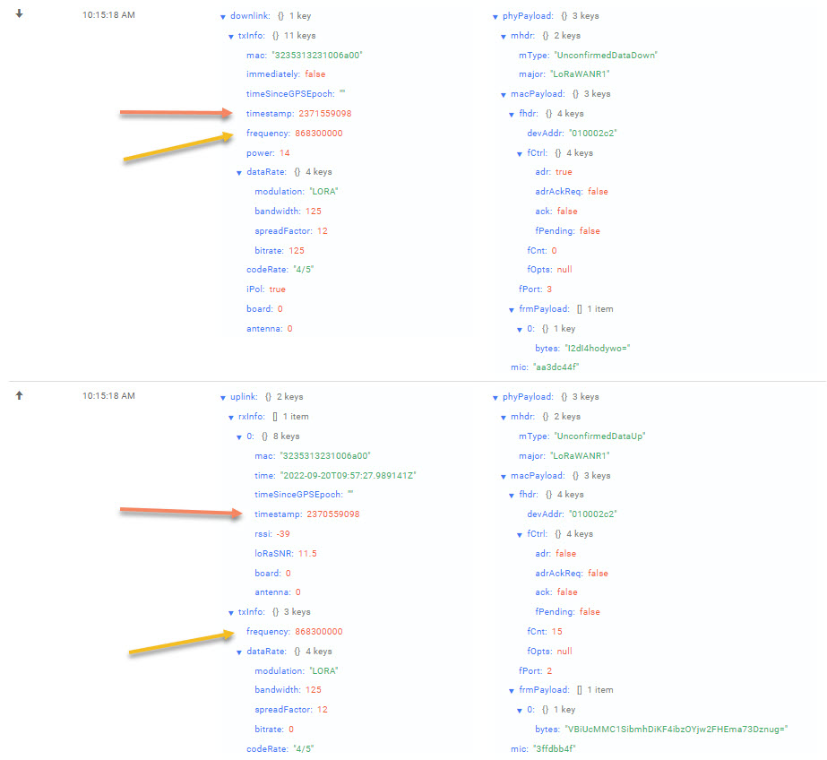

Sensefarms CUBE 02 series 


# Table of Contents
1. [Uplink format](#uplink-format-from-device-to-servers)
2. [Downlink format](#downlink-format-from-servers-to-device)
3. [Pre-defined downlink examples](#downlink-pre-defined-example-messages)

# Uplinks
## Uplink format from device to servers
_The message format is a proprietary dynamic payload format. It was not originally intended to be published, but due to customer responses we have decided to do so. Please send us requests for clarifications as this document evolves based on customer usage_

The CUBE01 and CUBE02 series wakes up from sleep and scans for sensors to read out. Once a sensor is found it is added to the payload, and the scan for sensors continues.  

The dynamic size format allows us to add and remove physical sensors to a device in the field, or mount the specific options before delivery to a customer without modifying the software in the device. 

**Sensor data in our node.js example do not save data from multiple similar sensors, it just prints them to the screen. Many programmers have therefore overwritten the previous sensor of the same type when using only a simple variable where an array is needed.

**Sensor data can suddenly stop to be included in the messages if a sensor is not detected. This usually correlates with a battery that needs replacement, or a cable that has been destroyed in some way.

## Payload

Every sensor has 1 header byte and atleast 1 byte for value.

| Header  | Value      | Header | Value | ... |
| :-----: | :--------: | :--------: | :--------: | :--------: |
| 1 Byte  | 1..N Bytes | 1 Byte | 1..N Bytes | ... |


### Header byte
Sensor header contains the type of sensor and a number to diffrentiate it from other sensors of the same type. This means each device can have a maximum of 8 sensors of the same type, usually temperature sensors inside and outside the device box.

| Bit 7..3 | Bit 2..0   |
| :------: | :--------: |
| Type     | ID 0..7    |


### Sensor Type (Uplink)
All multi-byte values are Big-endian.

| Hex  | Name               | Size | Format              | Comment                   |
| :---:| :---:              |:---: | :---:               | :---:                     |
| 0x00 | Proprietary        |      |                     | Data following this byte uses proprietary format |
| 0x01 | Temperature        | 4    | Float               |  &deg;C |
| 0x02 | Relative Humidity  | 2    | Unsigned (x/100)    | 0 -> 100.00%               |
| 0x03 | Accelerometer      | 6    | Signed 3(x/1000)    | X,Y,Z -32.767 -> 32.767 G |  
| 0x04 | Illuminance        | 4    | Unsigned, Float     | Lux                       |
| 0x05 | Analog             | 2    | Unsigned            | 0 -> 65535 mV             |
| 0x06 | Battery            | 2    | Unsigned            | 0 -> 65535 mV             |
| 0x07 | Altitude           | 4    | Signed, Float       | Meters                    |
| 0x08 | Pulse              | 2    | Unsigned            | 0-65535 pulses, Difference        |
| 0x09 | Pulse ABS          | 4    | Unsigned, Overflow  | 0-4294967295, Absolute  |
| 0x0A | Rotation           | 2    | Signed              |  –32768 -> +32767         |
| 0x0B | Rotation ABS       | 4    | Signed, Overflow    | -2147483648 -> +2147483647 |
| 0x0C | RSSI + SNR         | 2    | Unsigned (x-215) +  Signed | -215dBm -> +40dBm, -128dBm -> +127dBm |
| 0x0D | GPS                | 8    | Signed, Float 2x    | Latitude, Longitude (Degrees) |
| 0x0E | GPS Detailed       | 16   | Signed, Double 2x   | Latitude, Longitude (Degrees) |
| 0x0F | Wind Speed         | 2    | Unsigned (x/100)    | 0 -> 655.35 m/s |
| 0x10 | Wind Direction     | 2    | Unsigned (x/100)    | 0 -> 360.00 &deg; |
| 0x11 | State              | 1    | Bitmask             | Each bit represents a on/off state of thing. |
| 0x12 | Misc.              | 4    | Signed, Float       |                           |
| 0x13 | Resistance         | 4    | Unsigned            | 0 -> 4294967295 Ohm       |
| 0x14 | 64-bit ID          | 8    |                     | A 64-bit ID for next sensor |
| 0x15 | Soil Moisture      | 2    | Unsigned            | 0 -> 65535 kPa. If value is too low or too high (sensor not placed outdoors, cable broke, etc), the sensor data is considered invalid and may not be sent.| 
| 0x16 | Transmission Reason | 1   |                     | 0 = unknown reset, 1 = POR/PDR reset, 2 = Independt watchdog reset, 3 = windows watchdog reset, 4 = low power reset, 5 = POR/PDR reset, 6 = Normal transmission, 7 = Button reset |
| 0x17 | Protocol Version   | 2    | Unsigned            | Version 0 -> 65535 |
| ...  | RFU                |      |                     | Reserved for future use   |

## Example Uplink messages
```
Decoder started with 0xb006b800013008e898009c18f599009c18f50841a2501a
Sensor header byte 0xb0 decoded into type: 0x16 number 0
Sensor parameter byte 0x06
### Reason_for_transmission: Normal 
Sensor header byte 0xb8 decoded into type: 0x17 number 0
Sensor parameter byte 0x00
Sensor parameter byte 0x01
### Protocol Version 1 
Sensor header byte 0x30 decoded into type: 0x6 number 0
Sensor parameter byte 0x08
Sensor parameter byte 0xe8
### Voltage-0 2.28 V 
Sensor header byte 0x98 decoded into type: 0x13 number 0
Sensor parameter byte 0x00
[...]
```

# Downlinks
## Downlink pre-defined example messages

Common intervals ( with typical use-case ):
```
20 seconds ( lab use ), 3E061F00000014FE
10 minutes ( research agricultural trials ), 3E061F00000258FE
1 hour interval ( water temperature at baths ), 3E061F00000E10FE 
2 hour interval, 3E061F00001C20FE
3 hour interval, 3E061F00002A30FE
4 hour interval, 3E061F00003840FE
8 hour interval ( trees ), 3E061F00007080FE
```
### What is in these messages
One hour period message
```
3E061F00000E10FE 

0x3E = Header byte
0x06 = 6 bytes will follow
0x1F = Send period
0x00000E10 = 3600 seconds to sleep
0xFE = Reboot with new settings.
```

## Downlink troubleshooting
We have noted that common LoraWAN servers (TTN, Actility) are not able to send a downlink message reliably to our devices. Sometimes it works, sometimes it does not. We therefore recommend to always try downlinks several times in your office and make sure it works reliably, or pre-order the devices with the correct settings.

### Frequency / channel selection
The device sends uplink data on a random frequency/channel every time, but it expects to receive the downlink on the same frequency/channel as it has just sent data.
TTN-problem - TTN ABP devices downlinks are specified to a specific frequency. It is seldom the same frequency where the device has sent it's data. 

### Receive window delays
The device uses the pre-defined EU863-870 Default Settings found in https://lora-alliance.org/wp-content/uploads/2020/11/lorawan-regional-parameters-v1.1ra.pdf
```
RECEIVE_DELAY1 1 s
RECEIVE_DELAY2 2 s
```
TTN-Problem - The TTN server uses 5 seconds as default so it has time to respond and send the data to the gateway. They currently lack a RECEIVE_DELAY2 setting as well.

## Example
Note in the image that the uplink and downlink channels/frequencies match, and that there is exactly one second between the reception and scheduled transmission. 
Other settings are shown for reference. 

This was sent using a GSM connected Mikrotik Ltap Lora-8 gateway, using a https://www.chirpstack.io/ lora-wan server hosted in Sweden (local).




# Advanced Downlink information

## Downlink format from servers to device
For the CUBE02 series we adopted parts of the Elsys format ( see https://www.elsys.se/en/wp-content/uploads/sites/3/2016/09/ELSYS_downlink_payload_v2-1.pdf ) and it differs considerable from the downlink protocol. 
Elsys has an online message generator
https://www.elsys.se/en/downlink-generator/ ( Be careful of putting in the correct numbers without spaces as it does not check for errors. The reboot command needs a number even though that command does not use parameters. )

There must be a headerbyte of 0x3E first.

Then follows a byte with number of bytes following that byte. 

Supported commands are:

| Hex  | Name               | Size | Format              | Comment                   |
| :---:| :---:              |:---: | :---:               | :---:                     |
| 0x1F | Send Period        | 4    | Unsigned            | Seconds to sleep until next measurement |
| 0xFE | Reboot             | 0    | -                   | Reboot the device. This forced the device to use new settings. Reboot command should always be last in the command list as it does an immeditate reboot when read. |

_Do not send unsupported Elsys commands. They might work but has not been tested fully and will void your warranty and might brick your device. Examples are AppSKey, NwkSKey and DevAddr. Contact Sensefarm if needed for additional support._

(C) Sensefarm 2023
